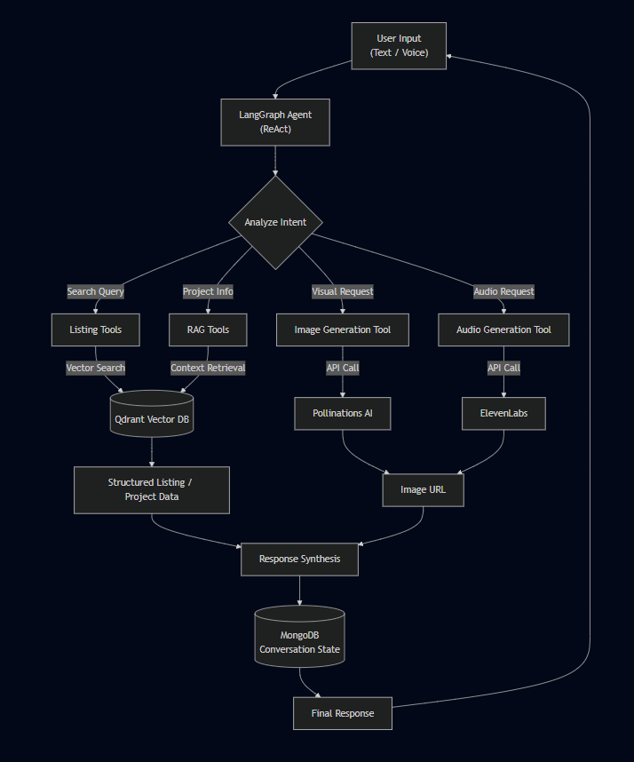

# 🤖 AI Chatbot Assistant (LangChain/LangGraph Edition)

Mô hình Chatbot AI tư vấn bất động sản chuyên nghiệp được xây dựng trên nền tảng **LangChain** và **LangGraph**, với khả năng đa phương thức (Văn bản, Hình ảnh, Âm thanh).

## 🎯 Project Objective

Dự án này nhằm mục đích xây dựng một trợ lý ảo bất động sản chuyên nghiệp, giải quyết các bài toán thực tế trong việc tư vấn và tìm kiếm nhà đất:

- **Mục tiêu**: Tự động hóa quy trình tư vấn sơ bộ, hỗ trợ tìm kiếm, so sánh bất động sản và cung cấp trải nghiệm đa phương tiện (xem ảnh mô phỏng, nghe giới thiệu).
- **Đối tượng sử dụng**: Khách hàng tìm mua/thuê nhà, nhân viên môi giới cần công cụ hỗ trợ, và các kỹ sư AI muốn tham khảo kiến trúc agent hiện đại.
- **Giá trị cốt lõi**: Kết hợp sức mạnh của LLM (Gemini) với dữ liệu thực tế (Qdrant Vector DB) để giảm thiểu ảo giác (hallucinations) và tăng tính chính xác.

## 🧠 Agent Workflow (LangGraph)

Quy trình xử lý của Agent được thiết kế theo luồng dữ liệu sau:



1. **User Input**: Người dùng gửi yêu cầu (tìm nhà, hỏi thông tin, vẽ ảnh...).
2. **Intent Analysis**: Agent phân tích ý định và trích xuất thực thể (Entities).
3. **Tool Selection**: Agent tự động quyết định công cụ phù hợp (Search, RAG, Image, Audio).
4. **Execution**: Các công cụ tương tác với Database hoặc API bên thứ 3.
5. **Synthesis**: Agent tổng hợp kết quả, kết hợp với ngữ cảnh lịch sử (Memory) để trả lời tự nhiên.

## 🏗️ Kiến trúc Hệ thống

```
chatbot/
├── app.py                    # Streamlit Entry point
├── verify_agent_cli.py       # CLI Verification Script
├── src/
│   ├── core/                 # ⚙️  Dependencies, config, logger
│   │   ├── config.py         # Configuration management
│   │   └── logger.py         # Logging setup
│   │
│   ├── agents/               # 🧠 Brain
│   │   └── estate_agent.py   # Main Agent (LangGraph ReAct)
│   │
│   ├── tools/                # 🛠️ LangChain Tools
│   │   ├── listing_tools.py  # Search, Details, Compare (Qdrant)
│   │   ├── rag_tools.py      # Project Info RAG
│   │   ├── booking_tools.py  # Appointment booking
│   │   ├── audio_tools.py    # ElevenLabs Text-to-Speech
│   │   └── image_tools.py    # Google Gemini Image Gen
│   │
│   ├── services/             # 🔧 Infrastructure Services
│   │   ├── chat_service.py   # Chat session management
│   │   ├── qdrant_service.py # Vector DB Interface
│   │   └── embedding_service.py # Text Embeddings
│   │
│   ├── ui/                   # 🎨 User interface
│   │   ├── chat_interface.py # Streamlit Chat UI (Media-aware)
│   │   └── ...
```

## 🧩 Agent Design Decisions

Tại sao lại chọn **Single Graph Agent** và **ReAct Pattern**?

- **Single Graph Agent**: Thay vì sử dụng multi-agent phức tạp (như AutoGen) ngay từ đầu, tôi chọn một graph agent duy nhất để tập trung vào sự nhất quán của trạng thái hội thoại (Conversation State) và giảm độ trễ (Latency).
- **ReAct Pattern**: Cho phép agent "Suy nghĩ" (Reasoning) trước khi "Hành động" (Acting). Điều này cực kỳ quan trọng trong tư vấn BĐS để agent hiểu rõ ràng khi nào cần tìm kiếm database và khi nào cần hỏi thêm thông tin từ người dùng.
- **Structured Outputs**: Các tool được thiết kế để trả về dữ liệu có cấu trúc (JSON/Dict) thay vì văn bản tự do, giúp LLM dễ dàng xử lý và định dạng lại câu trả lời chính xác.

## 🚀 Tính Năng Nổi Bật

### 1. 🤖 Estate Agent (LangGraph)

- **Tư duy ReAct**: Agent có khả năng suy luận, chọn công cụ phù hợp và trả lời thông minh.
- **Bộ nhớ hội thoại**: Sử dụng **MongoDB** để lưu trữ lịch sử bền vững.
- **Đa năng**: Xử lý đa tác vụ trong một luồng hội thoại duy nhất.

### 2. 🛠️ Hệ thống Tools Đa Phương Tiện

- **Quản lý Bất Động Sản**: Tìm kiếm, so sánh, xem chi tiết, gợi ý tương tự.
- **Đa phương tiện**: Tạo ảnh mô phỏng (Google Gemini) và đọc thông tin (ElevenLabs) để tăng trải nghiệm khách hàng.
- **Tiện ích**: Đặt lịch xem nhà thực tế, tra cứu thông tin pháp lý dự án.

## 🛠️ Cài đặt và Chạy

### 1. Cài đặt Dependencies

```bash
cd chatbot
pip install -r requirements.txt
```

### 2. Cấu hình

Tạo file `.env` và điền API Key:

```env
# AI Models
GEMINI_API_KEY=your_key

# Database
MONGODB_URL=mongodb+srv://... (Optional)
QDRANT_URL=http://localhost:6333
QDRANT_API_KEY=your_key

# Multimedia tools
ELEVEN_LABS_API_KEY=your_key
```

### 3. Khởi chạy

```bash
streamlit run app.py
```

## ⚠️ Limitations (Giới hạn)

- **Chất lượng dữ liệu**: Phụ thuộc vào dữ liệu đầu vào trong Qdrant. Nếu dữ liệu thiếu, agent có thể không tìm thấy kết quả.
- **Hallucination**: Dù đã dùng RAG, LLM vẫn có xác suất nhỏ bịa thông tin nếu câu hỏi quá mơ hồ.
- **Image Generation**: Hình ảnh tạo ra chỉ mang tính chất minh họa (concept art), không phải ảnh thực tế của căn hộ.
- **API Cost**: Việc sử dụng ElevenLabs và Gemini liên tục có thể phát sinh chi phí nếu lượng request lớn.

## 🔮 Future Improvements (Roadmap)

- [ ] **Multi-Agent System**: Tách biệt thành Sales Agent (chốt sale) và Support Agent (CSKH) chuyên biệt.
- [ ] **Voice Input**: Tích hợp Speech-to-Text để người dùng có thể nói chuyện trực tiếp với bot.
- [ ] **Personalization**: Gợi ý nhà dựa trên lịch sử xem và hành vi người dùng (Long-term memory).
- [ ] **Deployment**: Đóng gói Docker và triển khai lên Cloud Run / AWS ECS.
- [ ] **Evaluation**: Xây dựng bộ test RAGAS để đo lường độ chính xác của câu trả lời.

## 🧪 Testing & Verification

Dự án đi kèm script kiểm thử tự động:

```bash
python verify_agent_langgraph.py
```

## 🤝 Technology Stack

- **Core**: Python 3.10+, LangChain, LangGraph
- **AI Models**: Google Gemini, ElevenLabs
- **Database**: Qdrant (Vector), MongoDB (NoSQL)
- **UI**: Streamlit

## 📝 License

MIT License.
